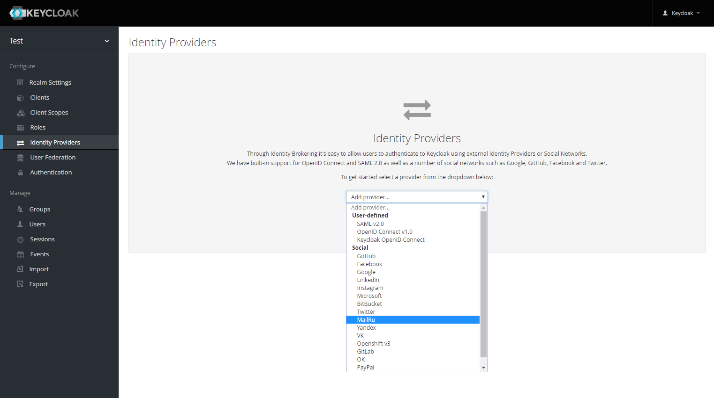
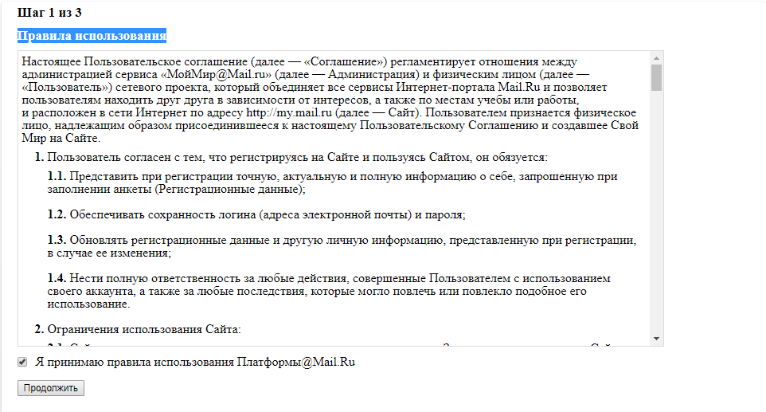
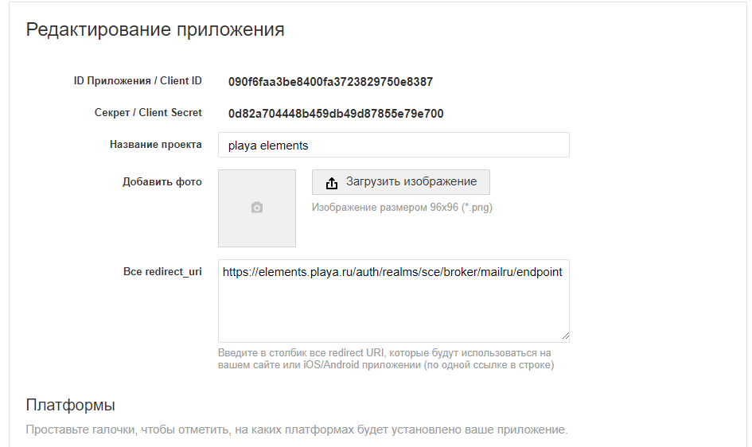
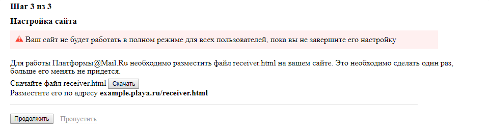
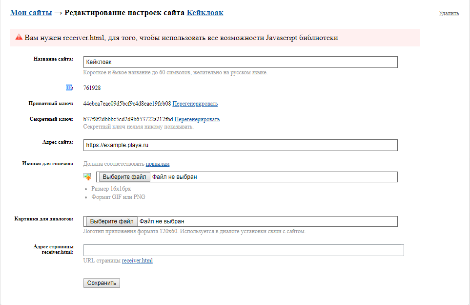

# Mail.Ru.

1. Из списка провайдеров выбрать [Mail.Ru](https://mail.ru). 

2. Создать приложение в [MailRu](https://api.mail.ru/sites/my/add).
3. Принимаем *Правила использования*. 

4. Заполняем *Информация о сайте*.

5. Этап *Настрока сайта* пропускаем. 

6. Заходим в редактирование настроек, только что созданного приложения. 

+ Значение поля *Адрес страницы receiver.html* заполнить значением *Redirect URI* из админки Keycloak.
7. Копируем значение *ID* в поле *Client ID* в админке *Keycloak*.
8. Копируем значение *Секретный ключ приложения* в поле *Client Secret* в админке *Keycloak*.
9. Нажимаем кнопку *Save* в админке *Keycloak*.
