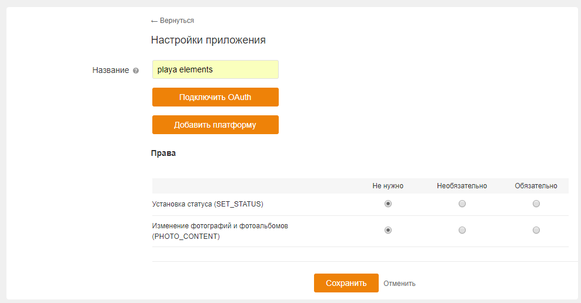
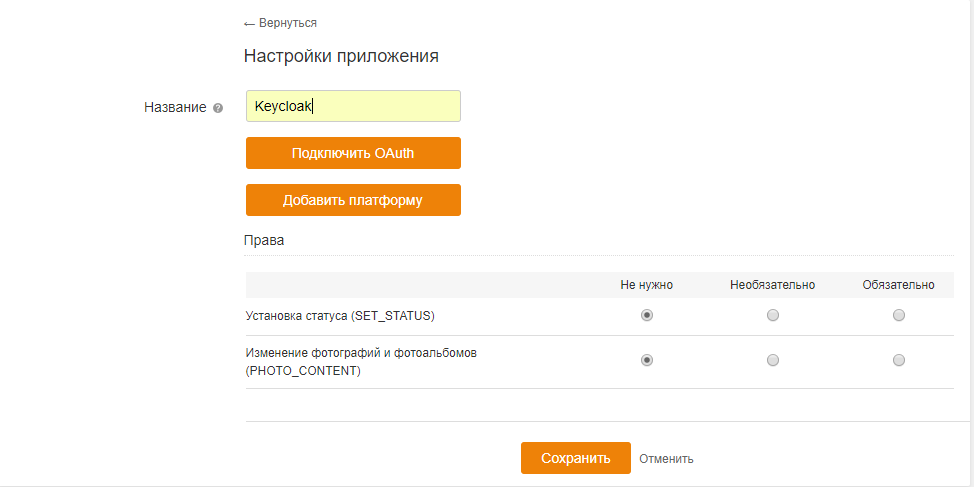
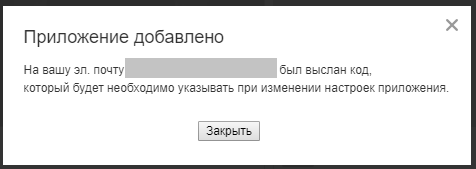
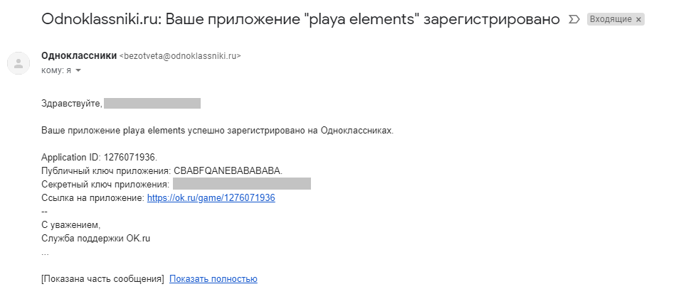
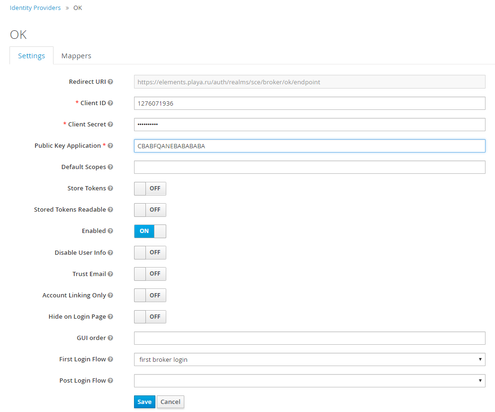

# Однокласники

**Создание и настройка приложения в [Однокласники](https://ok.ru)**

1. Создаём приложение.
+ Заполняем поле *Название*.

+ Нажимаем кнопку *Подключить OAuth*.
+ Заполняем поле *Список разрешённых redirect_uri* -
 https://${keycloak-host}/auth/realms/${realm-name}/broker/ok/endpoint, где _keycloak-host_ - домен на котором 
 размещен _Keycloak_, _realm-name_ - название _Realm_ в _Keycloak_.

+ Нажимаем кнопку *Сохранить*.
+ Откровается модальное окно с сообщением, что на электронную почту отправлены настройки приложения.

+ Открывем письмо с настройками приложения.

**Создание провайдера Keycloak**
1. Из списка провайдеров выбрать [Однокласники](https://ok.ru).

2. Копируем значение *Application ID* в поле *Client ID* в админке *Keycloak*.
3. Копируем значение *Секретный ключ приложения* в поле *Client Secret* в админке *Keycloak*.
4. Копируем значение *Публичный ключ приложения* в поле *Public Key Application* в админке *Keycloak*.
5. Нажимаем кнопку *Save* в админке *Keycloak*.

**Письмо с техподдержку**

Необходимо написать письмо с техподдержку социальной сети "Однокласники" с просьбой выдать права на получение 
электронной почты пользователя (GET_EMAIL). Для запроса прав необходимо прислать id приложения и перечень нужных 
разрешений с описанием кейса их использования на адрес api-support@ok.ru.
[Права приложения](https://apiok.ru/ext/oauth/permissions)

Авторизация **заработает**, после того как придет письмо с сообщением о том, что права выданы.
