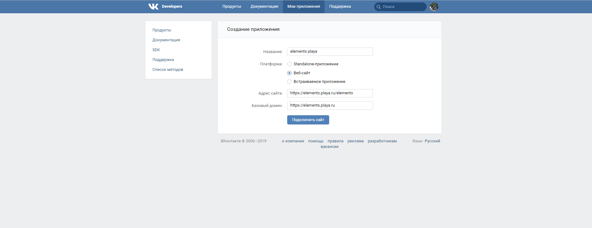
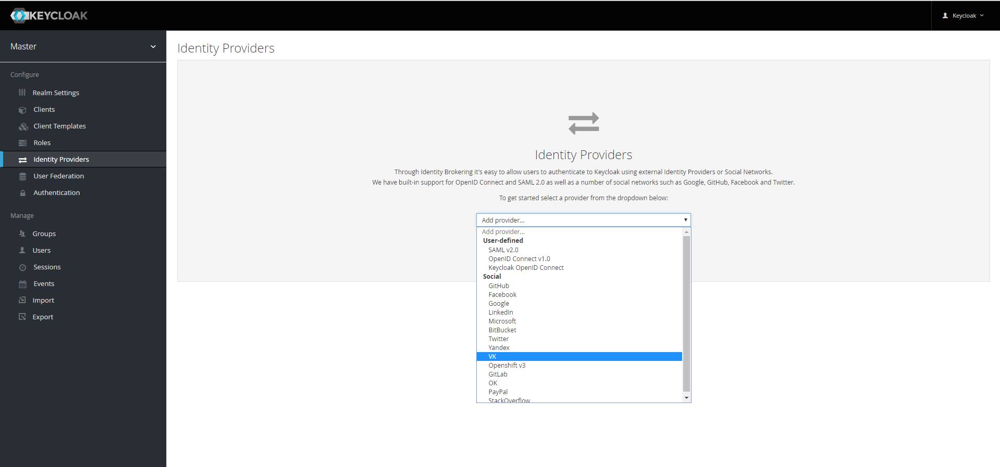
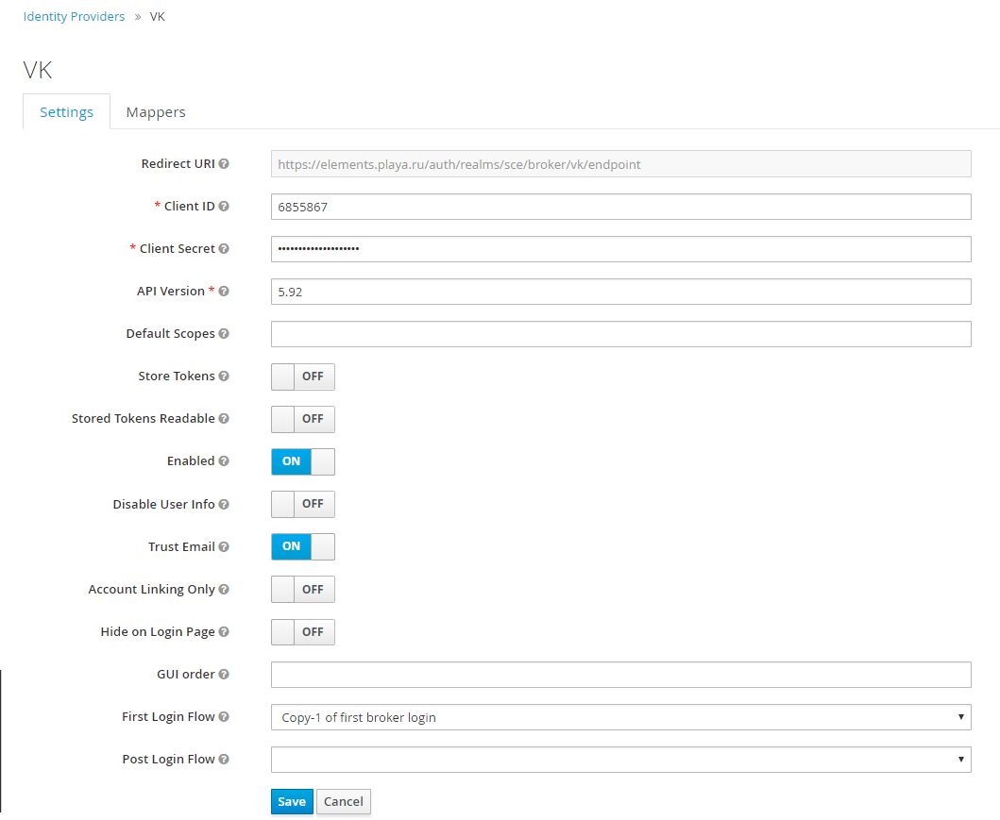

# ВКонтакте

**Создание и настройка приложения в [ВКонтакте](https://vk.com/editapp?act=create)**

1. Создание приложение.
+ Заполняем поле *Название*.
+ Поле *Платформа* выбираем *Веб-сайт*.
+ Заполняем поле *Адрес сайта*.
+ Заполняем поле *Базовый домен*.
+ Нажимаем кнопку *Подключить сайт*.

2. Настрока приложения.
+ Переходим в раздел **Настройки**.
+ Заполняем поле *Доверенный redirect URI* - https://${keycloak-host}/auth/realms/${realm-name}/broker/vk/endpoint, где
 _keycloak-host_ - домен на котором размещен _Keycloak_,
 _realm-name_ - название _Realm_ в _Keycloak_.

**Создание провайдера Keycloak**
1. Из списка провайдеров выбрать [ВКонтакте](https://vk.com).

2. Копируем значение *ID приложения* в поле *Client ID* в админке *Keycloak*.
3. Копируем значение *Защищённый ключ* в поле *Client Secret* в админке *Keycloak*.
4. Заполняем поле **API Version**. Текущую версию можно посмотреть [здесь](https://vk.com/dev/versions).
5. Нажимаем кнопку *Save* в админке *Keycloak*.

