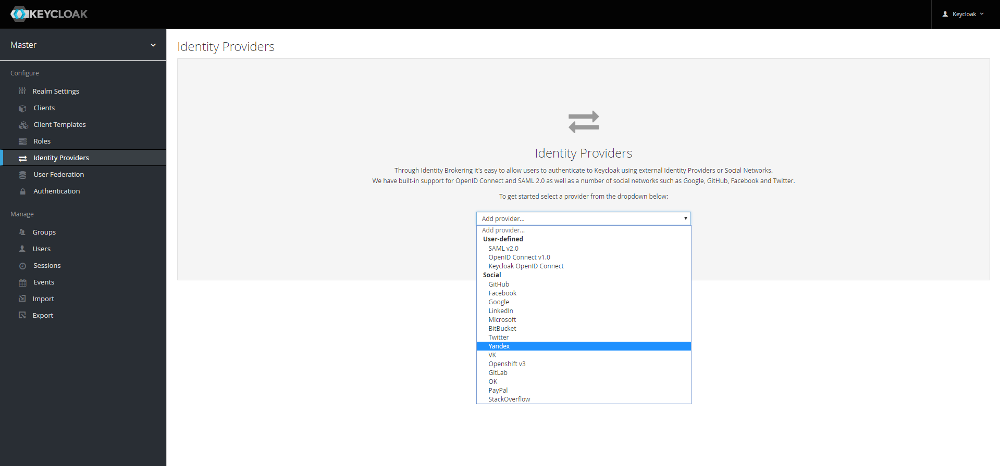
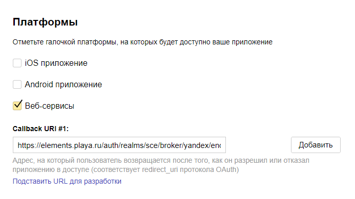
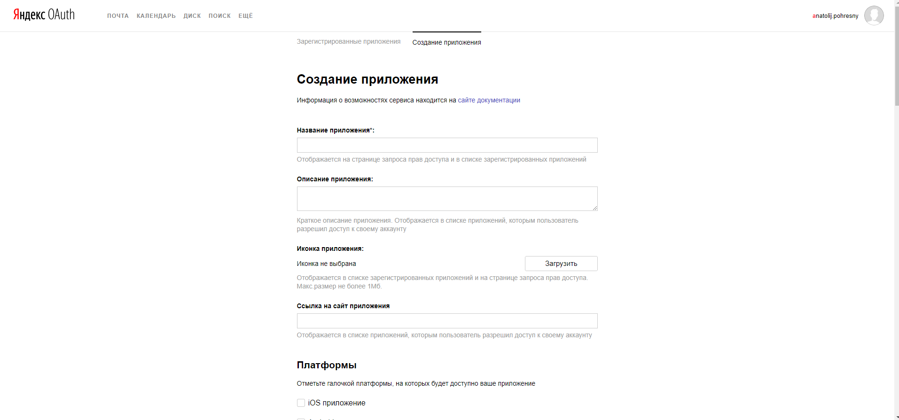
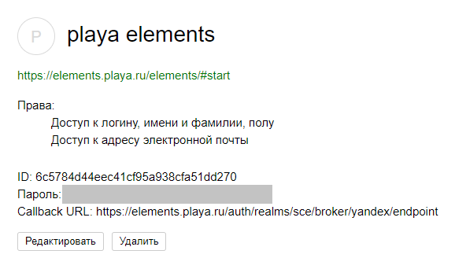
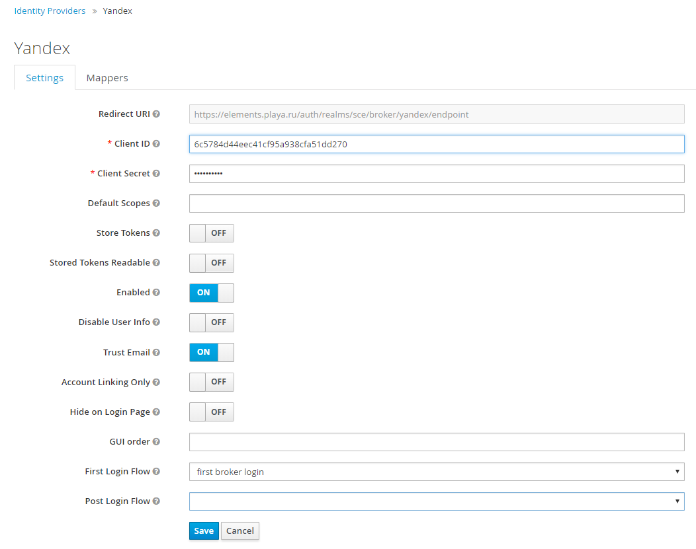

# Яндекс

**Создание приложения в [Яндекс](https://oauth.yandex.ru/client/new)**

_Создаём приложение._
1. Заполняем поле *Название приложения*.
2. Заполняем поле *Ссылка на сайт приложения*

3. Раздел *Платформы*.
+ В разделе *Платформы* выбираем *Веб-сервисы*.
+ Заполняем поле *Callback URI #1* - https://${keycloak-host}/auth/realms/${realm-name}/broker/yandex/endpoint, где
 _keycloak-host_ - домен на котором размещен _Keycloak_,
 _realm-name_ - название _Realm_ в _Keycloak_.
 
4. Раздел *Доступы* - *API Яндекс.Паспорта*.
+ Выбираем пункт _Доступ к адресу электронной почты._
+ Выбираем пункт _Доступ к логину, имени и фамилии, полу._
 
5. Нажимаем кнопку *Создать приложение*.
 

**Создание провайдера Keycloak**
1. Из списка провайдеров выбрать [Яндекс](https://yandex.ru).

2. Копируем значение *ID* в поле *Client ID* в админке *Keycloak*.
3. Копируем значение *Пароль* в поле *Client Secret* в админке *Keycloak*.
4. Нажимаем кнопку *Save* в админке *Keycloak*.
